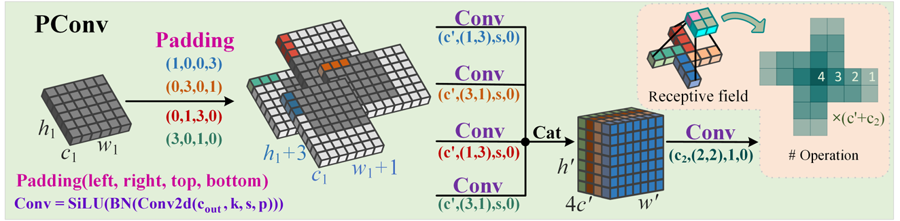

# YoLo Master


## Hacking YoLo with ultralytics

### 项目结构
```
.
├── C1 主干（Backbone）
│   ├── 1-RepViT
│   ├── 10-CSwinTransformer
│   ├── 2-Starnet
│   ├── 3-EfficientViT
│   ├── 4-FasterNet
│   ├── 5-ConvNeXtV2
│   ├── 6-EfficientFormerV2
│   ├── 7-LSKNet
│   ├── 8-SwinTransformer
│   └── 9-VanillaNet
├── C2 颈部（Neck）
│   └── 1-GFPN
├── C3 头部（Head）
│   └── 1-DyHead
├── C4 注意力机制（Attention）
│   ├── 1-CBAM
│   ├── 2-SE
│   └── 注意力机制使用说明.md
├── C6 其他
│   ├── 上下采样模块
│   └── 卷积模块
├── Images
└── README.md
```


### 飞书教程

- [YOLO系列魔改教程](https://wvet00aj34c.feishu.cn/docx/RXJKdo5ZJoT5QPxiV3vcpGPwnzX?from=from_copylink)


###  本节参考资料


## 更新日志


#### **C1 主干（Backbone）**：新增多个即插即用主干网络模块

##### （1）**RepViT (CVPR 2024)**

<div align=center>

</div>

`作者：Ao Wang, Hui Chen, Zijia Lin, Jungong Han, Guiguang Ding`

`团队：Tsinghua University; BNRist; The University of Sheffield`

论文地址：https://arxiv.org/pdf/2307.09283v8

代码地址：https://github.com/THU-MIG/RepViT

##### （2）**StarNet (CVPR 2024)**

<div align=center>

</div>

`作者：Xu Ma, Xiyang Dai, Yue Bai, Yizhou Wang, Yun Fu`

`团队：Northeastern University; Microsoft`

论文地址：https://arxiv.org/pdf/2403.19967

代码地址：https://github.com/ma-xu/Rewrite-the-Stars


##### （3）**EfficientViT (CVPR 2023)**

<div align=center>

</div>

`作者：Xinyu Liu, Houwen Peng, Ningxin Zheng, Yuqing Yang, Han Hu, Yixuan Yuan`

`团队：The Chinese University of Hong Kong; Microsoft Research`

论文地址：https://arxiv.org/pdf/2305.07027

代码地址：https://github.com/mit-han-lab/efficientvit


##### （4）**FasterNet (CVPR 2023)**

<div align=center>

</div>

`作者：Jierun Chen, Shiu-hong Kao, Hao He, Weipeng Zhuo, Song Wen, Chul-Ho Lee, S.-H. Gary Chan`

`团队：HKUST; Rutgers University; Texas State University`

论文地址：https://arxiv.org/pdf/2303.03667v3

代码地址：https://github.com/JierunChen/FasterNet


##### （5）**ConvNeXt V2**

<div align=center>

</div>

`作者：Sanghyun Woo, Shoubhik Debnath, Ronghang Hu, Xinlei Chen, Zhuang Liu, In So Kweon, Saining Xie`

`团队：KAIST; Meta AI, FAIR; New York University`

论文地址：https://arxiv.org/pdf/2301.00808

代码地址：https://github.com/facebookresearch/ConvNeXt-V2

##### （6）**Efficient Former V2 (ICCV 2023)**

<div align=center>

</div>

`作者：Yanyu Li, Geng Yuan, Yang Wen, Ju Hu, Georgios Evangelidis, Sergey Tulyakov, Yanzhi Wang, Jian Ren`

`团队：Snap Inc; Northeastern University`

论文地址：https://arxiv.org/pdf/2203.03952

代码地址：https://github.com/snap-research/EfficientFormer


##### （7）**LSKNet (IJCV 2024 & ICCV 2023)**

<div align=center>

</div>

`作者：Yuxuan Li, Xiang Li, Yimian Dai, Qibin Hou, Li Liu, Yongxiang Liu, Ming-Ming Cheng, Jian Yang`

`团队：VCIP, CS, Nankai University; Academy of Advanced Technology Research of Hunan; NKIARI, Futian`

论文地址：https://arxiv.org/pdf/2403.11735

代码地址：https://github.com/zcablii/LSKNet


##### （8）**Swin Transformer**

<div align=center>

</div>

`作者：Ze Liu, Yutong Lin, Yue Cao, Han Hu, Yixuan Wei, Zheng Zhang, Stephen Lin, Baining Guo`

`团队：Microsoft Research Asia`

论文地址：https://arxiv.org/pdf/2103.14030

代码地址：https://github.com/microsoft/Swin-Transformer
     


#### **C1 主干（Backbone）**：新增多个即插即用主干网络模块

##### （1）**VanillaNet**

<div align=center>

</div>

`作者：Hanting Chen, Yunhe Wang, Jianyuan Guo, Dacheng Tao`

`团队：Huawei Noah’s Ark Lab; School of Computer Science, University of Sydney`

论文地址：https://arxiv.org/pdf/2305.12972v2

代码地址：https://github.com/huawei-noah/VanillaNet

##### （2）**CSwin Transformer (CVPR 2022)**

<div align=center>

</div>

`作者：Xiaoyi Dong, Jianmin Bao, Dongdong Chen, Weiming Zhang, Nenghai Yu, Lu Yuan, Dong Chen, Baining Guo`

`团队：University of Science and Technology of China; Microsoft Research Asia ;Microsoft Cloud + AI`

论文地址：https://arxiv.org/pdf/2107.00652

代码地址：https://github.com/microsoft/CSWin-Transformer

#### **C2 颈部（Neck）**：新增即插即用颈部网络模块

##### （1）**GFPN (DEMO-YOLO)**

<div align=center>

</div>

`作者：Xianzhe Xu, Yiqi Jiang, Weihua Chen, Yilun Huang, Yuan Zhang, Xiuyu Sun`

`团队：Alibaba Group`

论文地址：https://arxiv.org/abs/2211.15444

代码地址：https://github.com/tinyvision/damo-yolo

#### **C3 头部（Head）**：新增即插即用头部网络模块

##### （1）**DynamicHead（DyHead）**

<div align=center>

</div>

`作者：Xiyang Dai, Yinpeng Chen, Bin Xiao, Dongdong Chen, Mengchen Liu, Lu Yuan, Lei Zhang`

`团队：Microsoft Redmond`

论文地址：https://arxiv.org/abs/2106.08322

代码地址：https://github.com/microsoft/DynamicHead

#### **C4 注意力机制（Attention）**：新增多个即插即用注意力机制网络模块

##### （1）**CBAM**

<div align=center>

</div>

`作者：Sanghyun Woo, Jongchan Park, Joon-Young Lee, In So Kweon`

`团队：Korea Advanced Institute of Science and Technology; Lunit Inc.; Adobe Research`

论文地址：https://arxiv.org/abs/1807.06521

##### （2）**SE**

<div align=center>

</div>

`作者：Jie Hu, Li Shen, Samuel Albanie, Gang Sun, Enhua Wu`

`团队：State Key Laboratory of Computer Science, Institute of Software, Chinese Academy of Sciences; Faculty of Science and Technology & AI Center at University of Macau`

论文地址：https://arxiv.org/abs/1709.01507

代码地址：https://github.com/hujie-frank/SENet

#### **C6 其他**：新增上、下采样和卷积即插即用模块

##### （1）**上采样模块 EUCB（EMCAD）**

<div align=center>

</div>

`作者：Md Mostafijur Rahman, Mustafa Munir, Radu Marculescu`

`团队：The University of Texas at Austin Austin`

论文地址：https://arxiv.org/abs/2405.06880

代码地址：https://github.com/SLDGroup/EMCAD

##### （2）**卷积模块 C2f_CMUNeXtBlock（CMUNeXt）**

<div align=center>

</div>

`作者：Fenghe Tang, Jianrui Ding, Lingtao Wang, Chunping Ning, S. Kevin Zhou`

`团队： School of Biomedical Engineering Division of Life Sciences University of Science and Technology of China (USTC); Center for Medical Imaging, Robotics, Analytic Computing and Learning (MIRACLE) Suzhou Institute for Advanced Research University of Science and Technology of China (USTC); Key Laboratory of Intelligent Information Processing Institute of Computing Technology Chinese Academy of Sciences (CAS);School of Computer Science and Technology, Harbin Institute of Technology; Ultrasound Department, The Affiliated Hospital of Qingdao University`

论文地址：https://arxiv.org/abs/2308.01239

代码地址：https://github.com/FengheTan9/CMUNeXt

##### （3）**风车卷积 PConv（Pinwheel-shaped Convolution）**

<div align=center>

</div>

`作者：Jiangnan Yang, Shuangli Liu, Jingjun Wu, Xinyu Su, Nan Hai, Xueli Huang`

`团队：School of Information and Engineering, Southwest University of Science and Technology; School of Electronic and Optical Engineering, Nanjing University of Science and Technology` 

论文地址：https://arxiv.org/abs/2412.16986v1

代码地址：https://github.com/JN-Yang/PConv-SDloss-Data